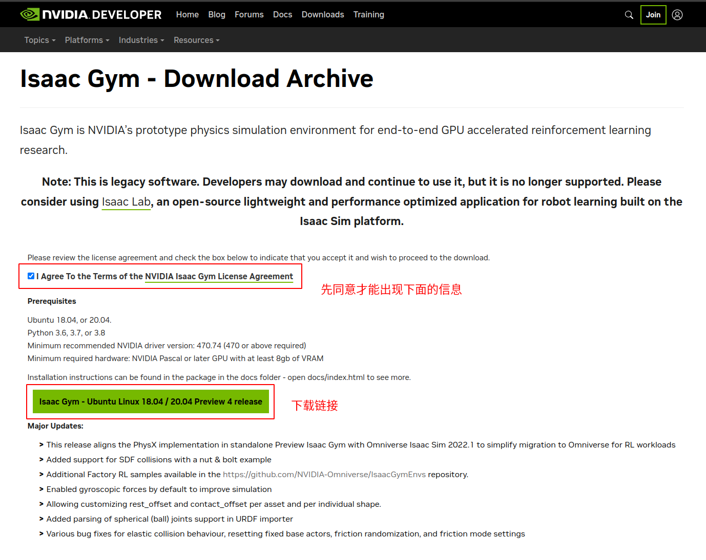
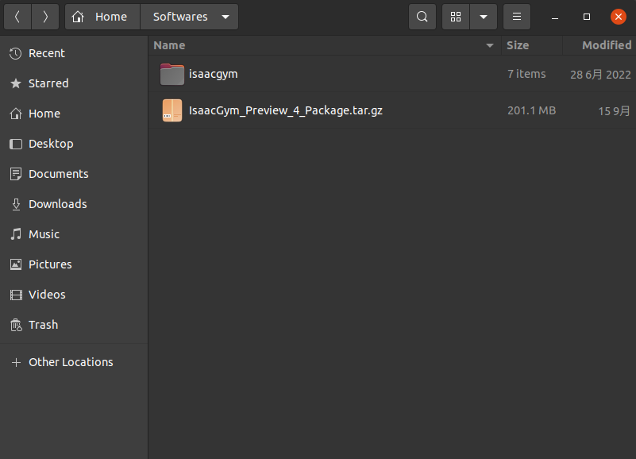

# IsaacGym-Learning

# 一、安装

## 1.1 下载安装包

下载链接：https://developer.nvidia.com/isaac-gym/

点击 `Download From Archive` 进入最新版本界面，下载安装包：

## 1.2 安装

安装包下载完后，解压：

解压出 `isaacgym` 文件夹，内容如下：

其中，`create_conda_env_rlgpu.sh` 为安装脚本，执行该脚本开始安装：

