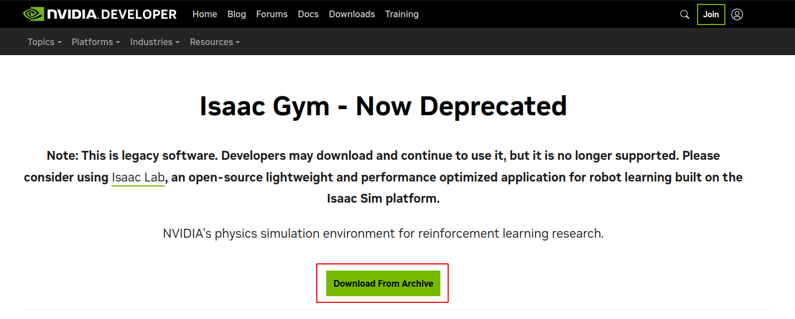
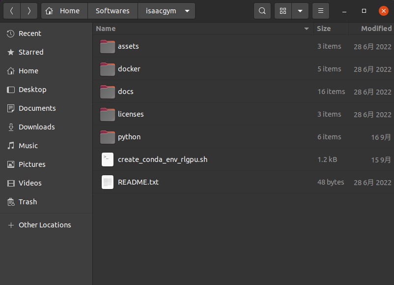
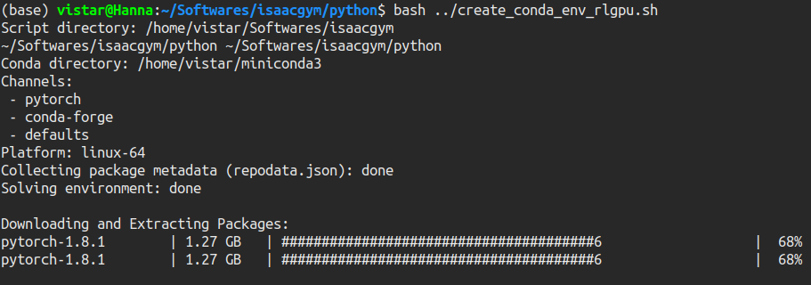
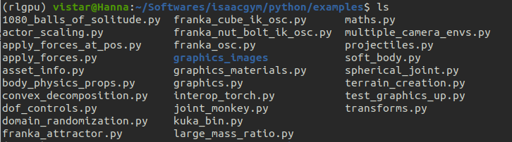
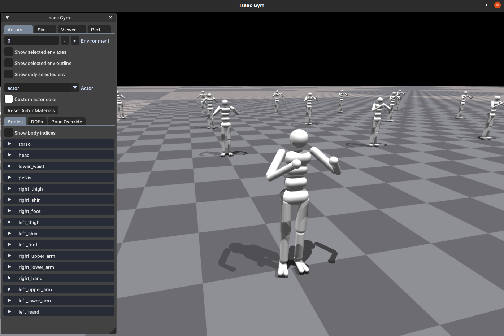

# IsaacGym-Learning

# 一、安装

## 1.1 下载安装包

下载链接：https://developer.nvidia.com/isaac-gym/

点击 `Download From Archive` 进入最新版本界面，下载安装包：

## 1.2 安装

安装包下载完后，解压：

解压出 `isaacgym` 文件夹，内容如下：

其中，`create_conda_env_rlgpu.sh` 为安装脚本，执行该脚本开始安装：

这一步要等一段时间，如果网速不好，时间会长一些，最终成功如下图：

## 1.3 运行demo

在`isaacgym`->`python`->`examples`目录下，官方自带了一些demo，可以验证安装是否成功，也可以用于后期学习

我们选择 `joint_monkey.py` ，执行 `python joint_monkey.py` 结果如下：

