# IsaacSim-Learning

官方文档：https://docs.omniverse.nvidia.com/isaacsim/latest/index.html

# 一、安装 Isaac Sim

安装环境：

|  项目  |             描述             |
| :----: | :--------------------------: |
|   OS   |      Ubuntu 20.04.6 LTS      |
| kernel |      5.15.0-117-generic      |
|  CPU   | Intel® Core™ i9-14900KF × 32 |
|  RAM   |             32GB             |
|  GPU   |   NVIDIA GeForce RTX 3070    |
|  VRAM  |             8GB              |
| Driver |          535.183.01          |
|  CUDA  |             12.2             |

## 1.1 安装Omniverse Launcher

Isaac Sim是建立在Omniverse平台之上的一个应用程序，所以要先安装Omniverse。

下载链接： [omniverse launcher](https://developer.nvidia.com/omniverse#section-getting-started)

打开后找到 `Ways to Get Started With NVIDIA Omniverse` 一节，在下方 `Download Omniverse Kit SDK for Windows and Linux` 选择 `Linux`。

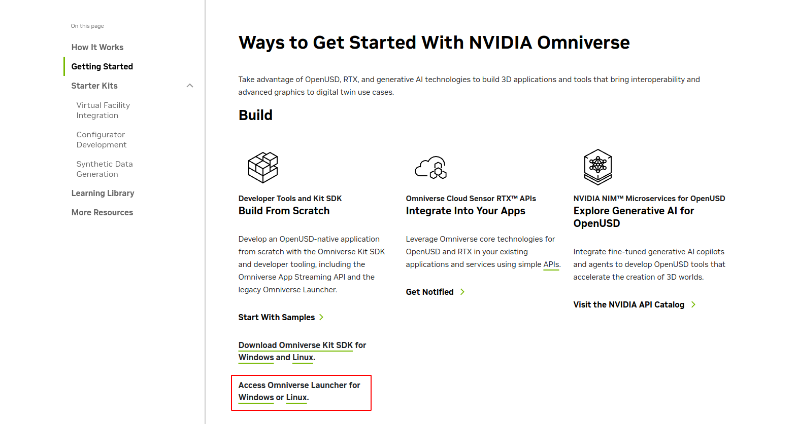

下载完成后，右键选择 `Properties` ，赋予可执行权限：

（也可以使用命令行 `chmod +x omniverse-launcher-linux.AppImage` ，同样的效果）

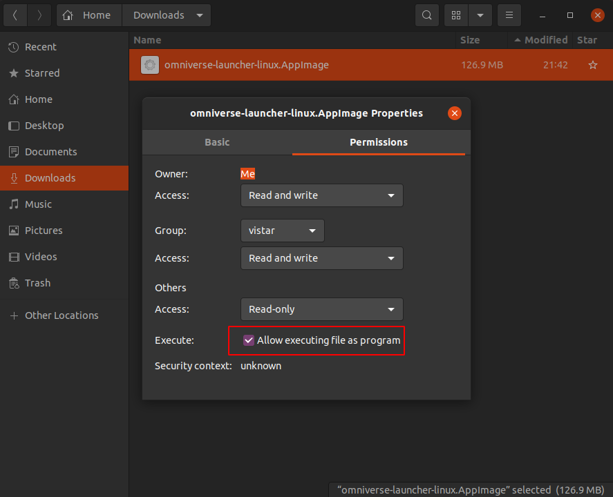

然后直接双击 `omniverse-launcher-linux.AppImage` 打开 `Omniverse Launcher` 

(或在该文件同级目录执行命令 `./omniverse-launcher-linux.AppImage`)

打开后需要登录 `Nvidia` 账户，没有可以去官网注册一个。

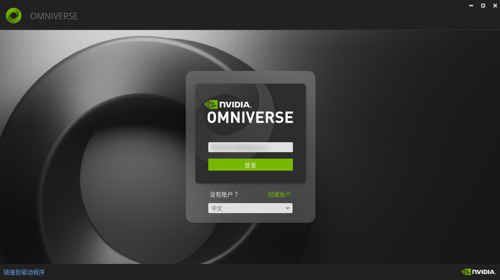

登录后一路点继续，最后进入如下界面：

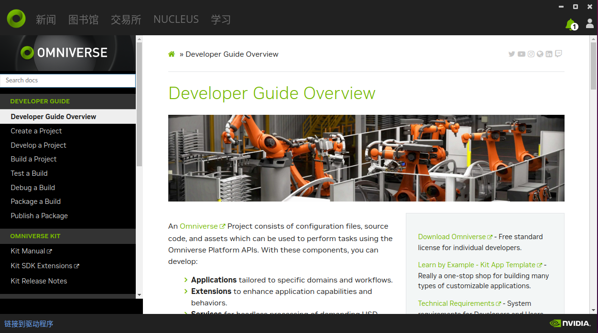

在交易所（Exchange）中搜索 `Isaac Sim`：

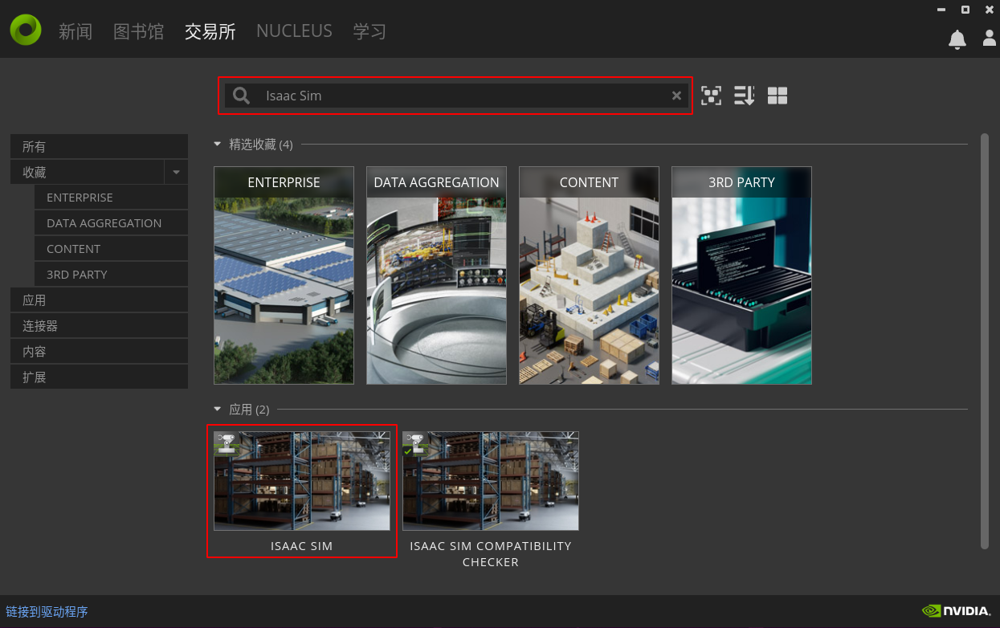

点击下面应用中的 `ISAAC SIM` 进入安装界面：

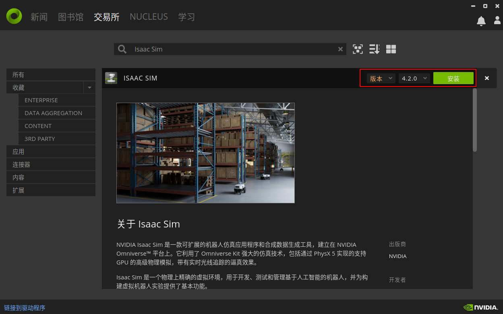

点击安装，开始下载并安装 `Isaac Sim` ：

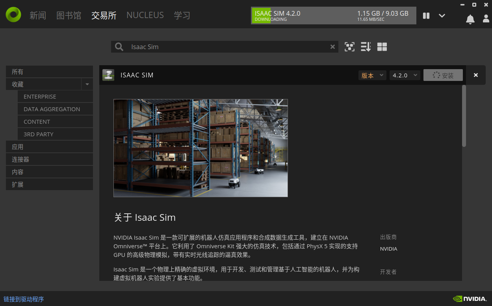

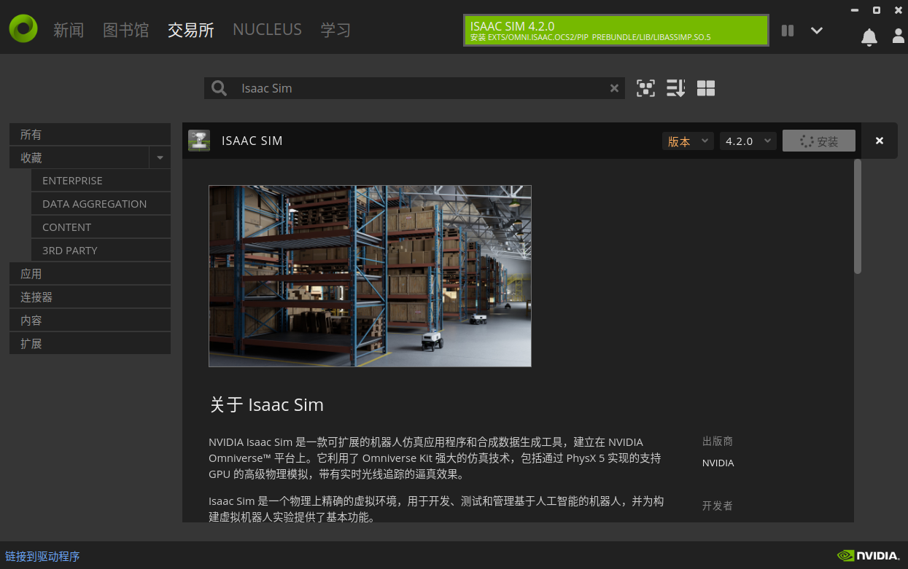

安装过程中会提示安装 `cache` ，它提供一种软件缓存服务，可优化 Omniverse 应用程序和连接器之间的数据传输，建议安装它。安装方法和 `Isaac Sim` 一样，在交易所（Exchange）中搜索 `cache` ，点击下面应用中的 `OMNIVERSE CACHE` 进入安装界面，安装。

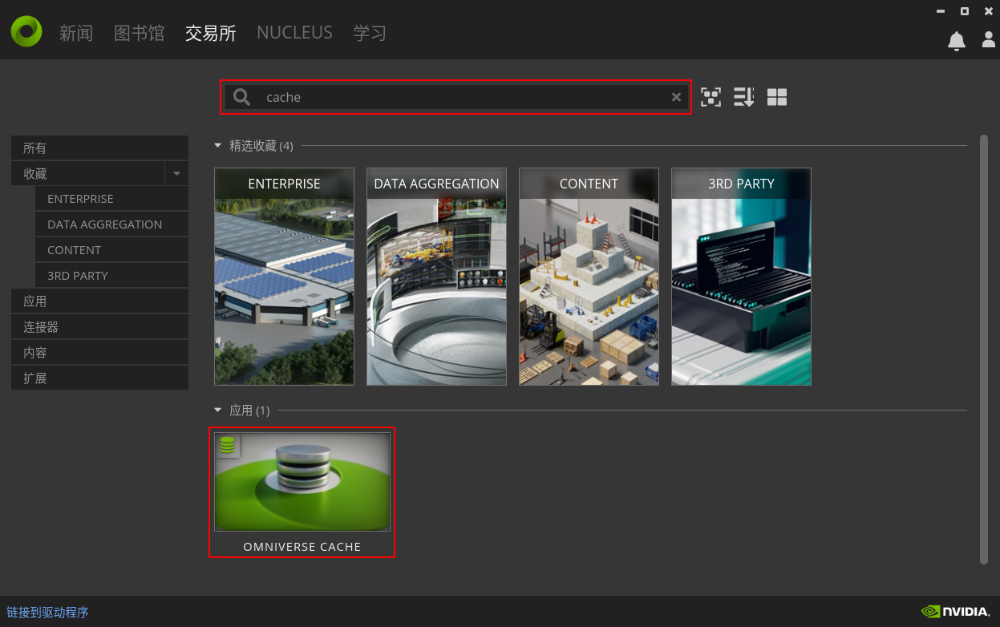

## 1.2 运行 Isaac Sim

在图书馆（Library）中找到 `Isaac Sim` 点击启动。

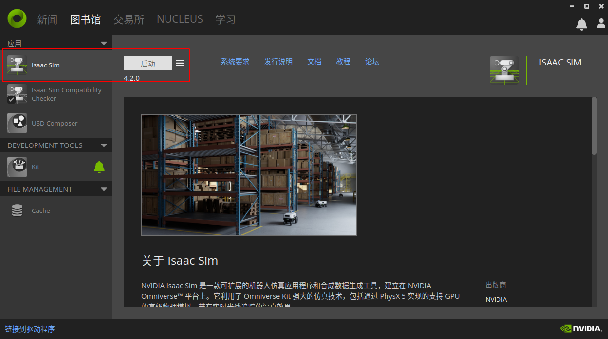

会有一个APP选择界面，我们选择自己的ROS版本：

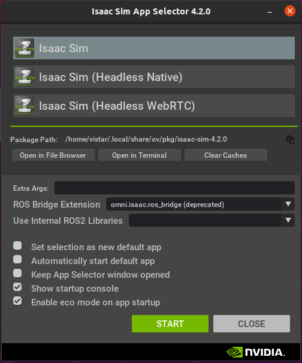

启动后界面如下：

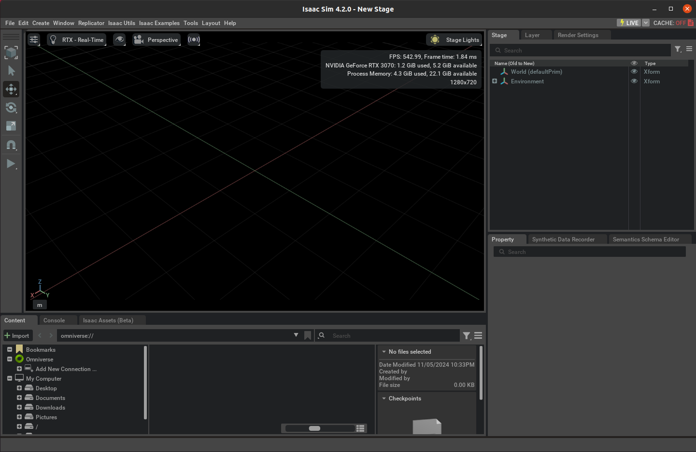

## 1.3 运行demo

