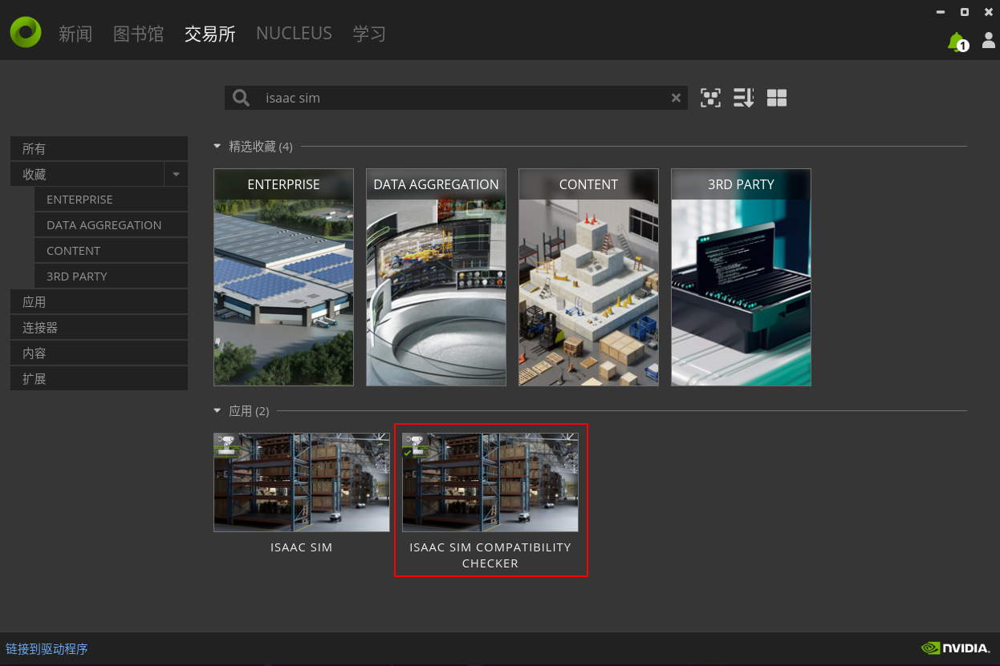
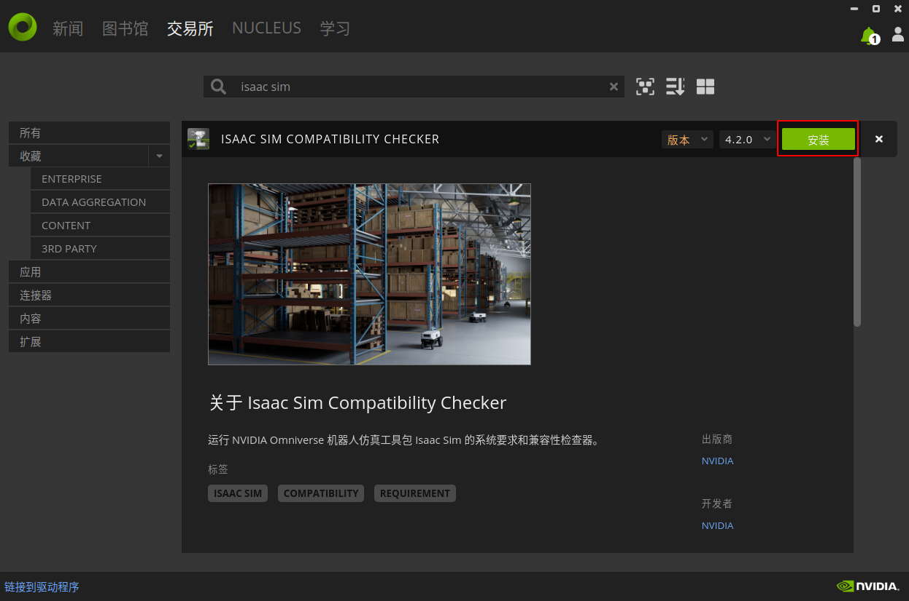
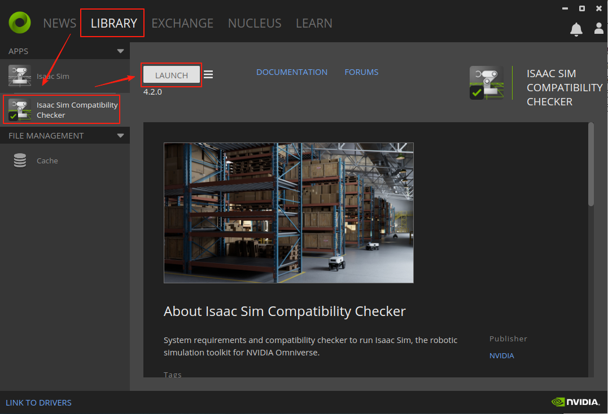
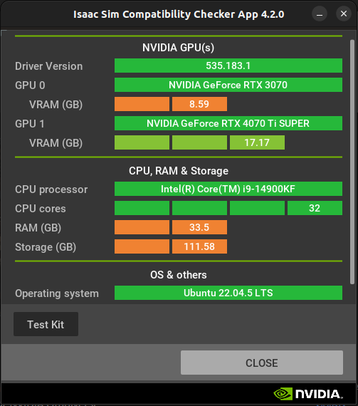
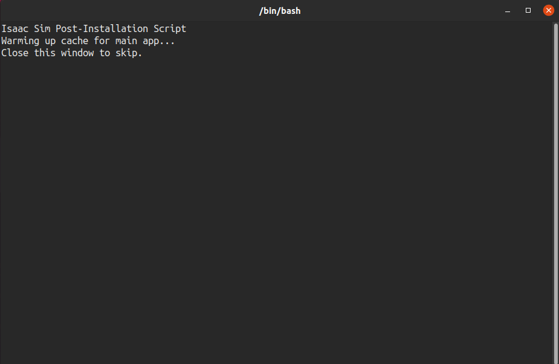
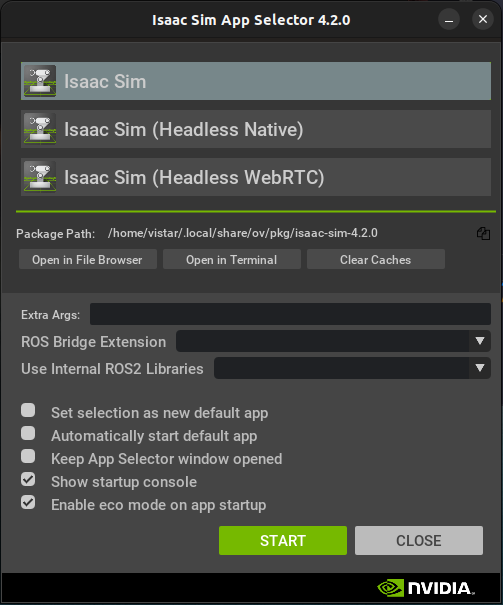
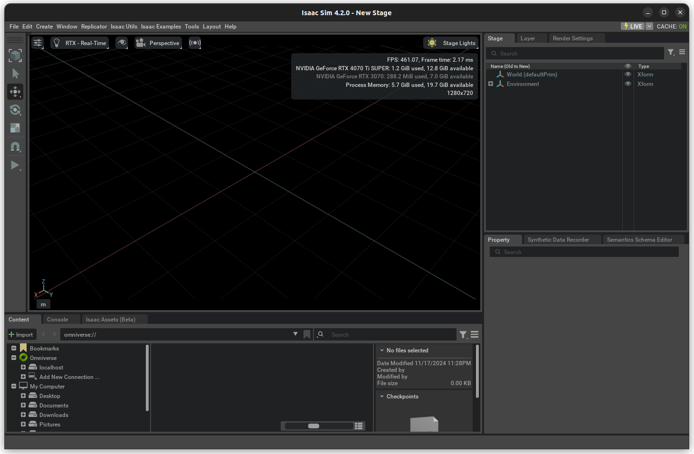

# IsaacSim-Learning

官方文档：https://docs.omniverse.nvidia.com/isaacsim/latest/index.html

# 一、安装 Isaac Sim

安装环境：

|  项目  |               描述               |
| :----: | :------------------------------: |
|   OS   |        Ubuntu 22.04.5 LTS        |
| kernel |         6.8.0-48-generic         |
|  CPU   |     Intel® Core™ i9-14900KF      |
|  RAM   |               32GB               |
|  GPU   | NVIDIA GeForce RTX 4070 Ti SUPER |
|  VRAM  |               16GB               |
| Driver |            535.183.01            |
|  CUDA  |               12.2               |

## 1.1 安装Omniverse Launcher

Isaac Sim是建立在Omniverse平台之上的一个应用程序，所以要先安装Omniverse。

下载链接： [omniverse launcher](https://developer.nvidia.com/omniverse#section-getting-started)

打开后找到 `Ways to Get Started With NVIDIA Omniverse` 一节，在下方 `Download Omniverse Kit SDK for Windows and Linux` 选择 `Linux`。

下载完成后，右键选择 `Properties` ，赋予可执行权限：

（也可以使用命令行 `chmod +x omniverse-launcher-linux.AppImage` ，同样的效果）

然后直接双击 `omniverse-launcher-linux.AppImage` 打开 `Omniverse Launcher` 

(或在该文件同级目录执行命令 `./omniverse-launcher-linux.AppImage`)

打开后需要登录 `Nvidia` 账户，没有可以去官网注册一个。

登录后一路点继续，最后进入如下界面，Omniverse Launcher 就安装成功了：

## 1.2 检查兼容性

NVIDIA Omniverse 提供了 `Isaac Sim Compatibility Checker` 软件，用于检查 `Isaac Sim` 对电脑系统配置和兼容性的要求。

在交易所（Exchange）中搜索 `Isaac Sim`，点击下面应用中的 `ISAAC SIM COMPATIBILITY CHECKER` 进入安装界面：

点击安装，开始下载并安装 `Isaac Sim Compatibility Checker` ：

安装成功后，到图书馆（LIBRARY）中找到 `Isaac Sim Compatibility Checker` ，点击启动（LAUNCH）：

会检查系统的各项配置，并给出检查结果：

对配置要求分了4个等级，其中，深绿色（优秀）、浅绿色（良好）、橙色（足够，建议更高）和红色（不够/不支持）

官网给出的系统配置要求：

| Element | Minimum Spec                              | Good                                      | Ideal                                                        |
| ------- | ----------------------------------------- | ----------------------------------------- | ------------------------------------------------------------ |
| OS      | Ubuntu 20.04/22.04Windows 10/11           | Ubuntu 20.04/22.04Windows 10/11           | Ubuntu 20.04/22.04Windows 10/11                              |
| CPU     | Intel Core i7 (7th Generation)AMD Ryzen 5 | Intel Core i7 (9th Generation)AMD Ryzen 7 | Intel Core i9, X-series or higherAMD Ryzen 9, Threadripper or higher |
| Cores   | 4                                         | 8                                         | 16                                                           |
| RAM     | 32GB*                                     | 64GB*                                     | 64GB*                                                        |
| Storage | 50GB SSD                                  | 500GB SSD                                 | 1TB NVMe SSD                                                 |
| GPU     | GeForce RTX 3070                          | GeForce RTX 4080                          | RTX Ada 6000                                                 |
| VRAM    | 8GB*                                      | 16GB*                                     | 48GB*                                                        |

官网给出的 Nvidia 驱动最低要求：

| Driver Version Support | Windows                                                    | Linux                                                 |
| ---------------------- | ---------------------------------------------------------- | ----------------------------------------------------- |
| Recommended            | 537.58 (GameReady, Studio), 537.70 (RTX/Quadro, Grid/vGPU) | 535.129.03 (GameReady, Studio, RTX/Quadro, Grid/vGPU) |
| Minimum                | 537.58 (GameReady, Studio), 537.70 (RTX/Quadro, Grid/vGPU) | 535.129.03 (GameReady, Studio, RTX/Quadro, Grid/vGPU) |

## 1.3 安装 Isaac Sim

在交易所（Exchange）中搜索 `Isaac Sim`：

点击下面应用中的 `ISAAC SIM` 进入安装界面：

点击安装，开始下载并安装 `Isaac Sim` ：

安装过程中会提示安装 `cache` :

`cache`提供一种软件缓存服务，可优化 Omniverse 应用程序和连接器之间的数据传输，建议安装它。安装方法和 `Isaac Sim` 一样，在交易所（Exchange）中搜索 `cache` ，点击下面应用中的 `OMNIVERSE CACHE` 进入安装界面，安装。

## 1.4 运行 Isaac Sim

在图书馆（Library）中找到 `Isaac Sim` 点击启动。

会有一个APP选择界面，默认点击 `START`：

启动后界面如下：（刚启动需要加载资源，可能有些卡，等一会就好了）

## 1.5 配置本地服务器

 Isaac Sim 添加自带的模型或运行自带的Demo，都需要从 Nvidia 公司的服务器下载资产文件，国内下载非常慢，还会由于网络原因导致 Isaac Sim 软件卡死。

Omniverse 提供了本地（局域）服务器 Nucleus，可以将资产下载到该服务器，用于本地或局域共享用户访问，避免了由于访问网络服务器导致的加载资产慢的问题。

## 1.6 运行demo

https://docs.omniverse.nvidia.com/nucleus/latest/index.html

